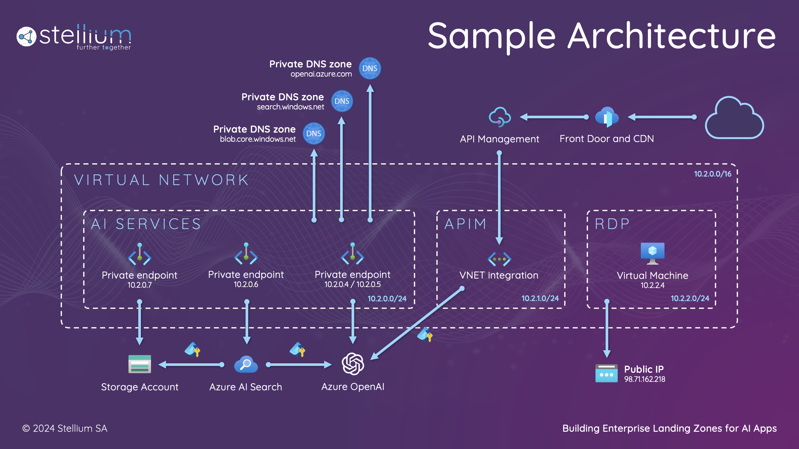

# 🚀 Building Enterprise Landing Zones for AI Apps



This repository contains all the artifacts that have been used to build the infrastructure presented at Microsoft Build AI Day in Switzerland during my session.
With minimum setup, you can clone this repository and start working with your IT team to build an initial landing zone aimed at unlocking the usage of Azure OpenAI in your organization.

## Contents

```
├── images (Images used in the readme.md file)
├── samples
│   ├── load-balancer/loadbalancer (A .NET 8 console application to test chat completion API calls against Azure Open AI and API Management)
│   ├── storage (Contains documents uploaded to Azure AI search for demo purposes)
├── terraform
│   ├── deployment (Contains the terraform modules used to deploy the infrastructure used during the session)
│   │   ├── **/*.tf
│   ├── post-configuration (Contains the terraform modules used to configure Azure AI Search with a data source, an indexer, a skillset and an index)
│   │   ├── **/*.tf
├── tests
│   ├── chat-completion.ps1 (Test an API call to Azure Open AI Chat completion endpoint from the Virtual Machine)
│   ├── lookup-services.ps1 (Performs an nslookup to the 4 endpoints of the services with private endpoints)
│   ├── lookup-services.bash (Performs an nslookup to the 4 endpoints of the services with private endpoints)
└── .gitignore
```

## Quick Start

### Step 1
Clone or download this repository to your machine.

### Step 2
Create a terraform variable file to be used as an input (*.tfvars). 
The example below illustrates how the file should be structured. 
You can also open [variables.tf](terraform/deployment/variables.tf) and check the required variables and formats.

```terraform
resource_suffix = "ch-msbuild-ai"

location = "westeurope"

resource_group = {
  name = "rg"
}

network_resource_group = {
  name = "rg-network"
}

open_ai = {
  name      = "oai"
  locations = ["swedencentral", "australiaeast"]
}

storage = {
  name           = "storage",
  container_name = "documents"
}

ai_search = {
  name        = "search",
  api_version = "2023-10-01-Preview"
}

apim = {
  name = "apim"
}

tags = {
  "description" = "AI Landing Zone"
}

virtual_network = {
  address_space = ["10.2.0.0/16"],
  name          = "vnet",
  subnets = {
    ai   = "10.2.0.0/24",
    apim = "10.2.1.0/24",
    vm   = "10.2.2.0/24"
  }
}

virtual_machine = {
  name = "vm"
}
```

### Step 3

Open a terminal window and login with an account with contributor permissions on the subscription you wish to use.

```bash
az login --tenant [Tenant_ID]
az account set -n [Subscription_ID]
```

### Step 4

Initialize your terraform workspace inside /terraform/deployment and plan the deployment.

```bash
terraform init
terraform plan -out plan -var-file variables.tfvars
```

Once you are happy with the changes apply the plan

```bash
terraform apply plan
```

### Step 5

After the deployment has been successfully done, initialize your terraform workspace inside /terraform/post-configuration and plan the deployment.
This module creates the Index, Data source, Skillset and Indexer required to process documents uploaded to the storage account.

```bash
terraform init
terraform plan -out plan -var-file variables.tfvars
```

Once you are happy with the changes apply the plan

```bash
terraform apply plan
```

## Support

If you encounter any issue or have questions about this repo, please open an issue.
I will be monitoring it for some time after the presentation.

Have fun!